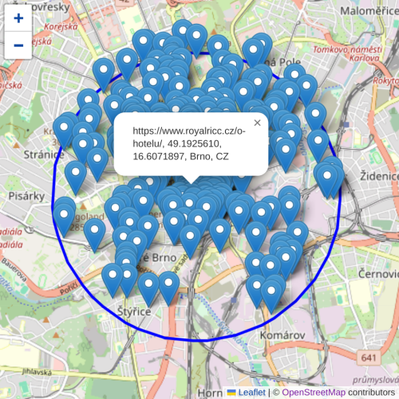
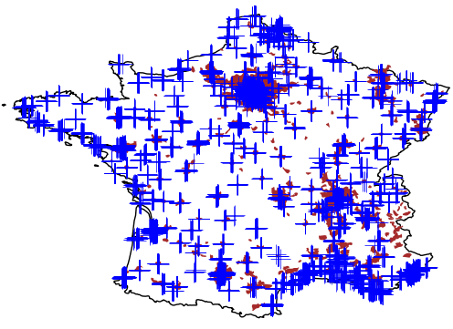

# GeoWeb

GeoWeb is a method for online information retrieval related to a geographical area



# Description

GeoWeb method is a generic resource for online information retrieval based on geography

GeoWeb provides **latitude,longitude,city,country** for each webpage

This repository provides source code for the method and sample data

Sample data are provided for 25 countries - Germany, United States, Netherlands, France, Canada, Italy, Spain, Poland, Belgium, United Kingdom, Japan, Switzerland, Austria, Finland, Czechia, Sweden, Slovakia, Hungary, Portugal, Romania, India, Croatia, Denmark, Australia, and Argentina

# Instructions

GeoWeb data are produced by the method implementation in [geo-web-method.ipynb](geo-web-method.ipynb)

Ready-to-use sample GeoWeb data for countries are provided in [geo-web-results](geo-web-results) with their statistical description in [geo-web-results.ipynb](geo-web-results.ipynb)

A demo use in [geo-web-demo.ipynb](geo-web-demo.ipynb) lists local webpages from a defined spatial circle around a city centre and shows how to fetch content

# Content

Source code

- [geo-web-method.ipynb](geo-web-method.ipynb) - Geographical method to process GeoWeb data for a country
- [geo-web-results.ipynb](geo-web-results.ipynb) - Statistical description of sample GeoWeb data for a country
- [geo-web-demo.ipynb](geo-web-demo.ipynb) - Example use of GeoWeb data for online information retrieval from an area

Results 

- [geo-web-results](geo-web-results) - Sample GeoWeb data for 25 countries
- [geo-web-maps](geo-web-maps) - Maps of sample GeoWeb data

Used-data

- [global-websites](global-websites) - Global websites from Majestic million 

# Samples

Sample data records

Format: webpage, latitude, longitude, city, country, online

```python
https://www.autoservisnovabela.cz/cz/aktualne/,49.7573966,18.2478364,Ostrava,CZ,20230331195431
https://www.marinaristorante.cz/o-nas,50.0891443,14.4138050,Prague,CZ,20230325074808
http://penzionsolnice.cz/kontakty.html,48.8576081,16.0492147,Znojmo,CZ,20230609180504
https://www.pivovar-strakonice.cz/exkurze,49.2597449,13.8976429,Strakonice,CZ,20230314042044
http://www.ssk-tms.cz/sport.htm,50.0255202,15.7874226,Pardubice,CZ,20231004095551
https://www.trutnov-ubytovani.cz/apartmany/apartman1/,50.5780627,15.9440328,Trutnov,CZ,20230325164810
```

Sample online information from a defined geographical area

Common food offers and price (local currency)

Information valid for lat 49.3547110, lon 16.6454532, city Blansko, Czechia

```r
French fries 45
Rice 42
Bun dumplings 44
Baked potatoes 45 
Bread 8
Fried potato croquettes	49 
Pastry 8
```

Sample coverage 

Data locations in France




# Notes

GeoWeb data include raw webpage content provided by Internet Archive; raw data include the content as it is, e.g. including page not-loaded texts or domain-abandoned information

Specific GeoWeb data filtering based on keywords or text analysis will produce the online content from a defined geographical area

GeoWeb method is based on crowd-sourced information from OpenStreeMap

Content of processed webpages for a location may be relevant to more than one place

We recommend statistical processing of the webpage content retrieved for a geographical area to remove outliers and exceptions 

# Options

Options provided in [geo-web-method.ipynb](geo-web-method.ipynb) to produce GeoWeb data

```python 
# country ISO A2 code 
COUNTRY = 'FR' 

# min,max population of country cities to be included
CITY_POP_MIN = 15000
CITY_POP_MAX = 100000000 #any large city

# from,to time range of geo-web seen online to be included
YEAR_FROM = 2023
YEAR_TO = 2024
``` 

Volume of the data and time of processing depends on the OSM mapping data availability in country/city

Data processing takes long time due to limited REST API calls (one per second)

Optional simple cache is implemented to speed-up repeated requests

# Acknowledgements 
- Mapping data and geocoding from [OpenStreetMap](https://openstreetmap.org/copyright) 
- Webpages from Internet Archive [Wayback Machine](https://archive.org/about/terms.php) 
- Global websites from [Majestic](https://majestic.com/reports/majestic-million?domain=&majesticMillionType=0&tld=&oq=&canUseDefault=) 
- Country borders and populated areas from [Natural Earth](https://www.naturalearthdata.com/)